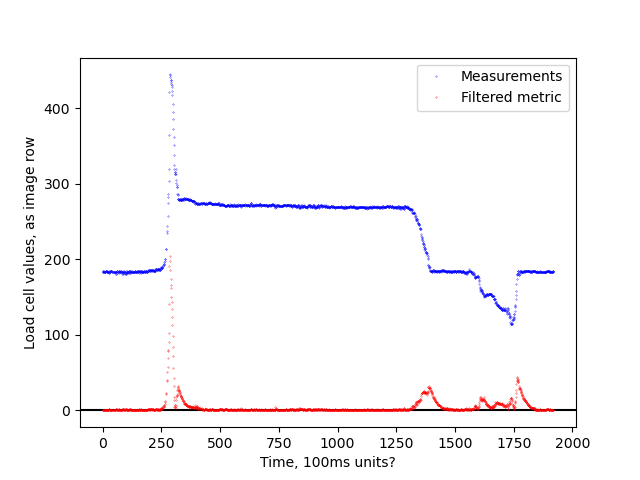
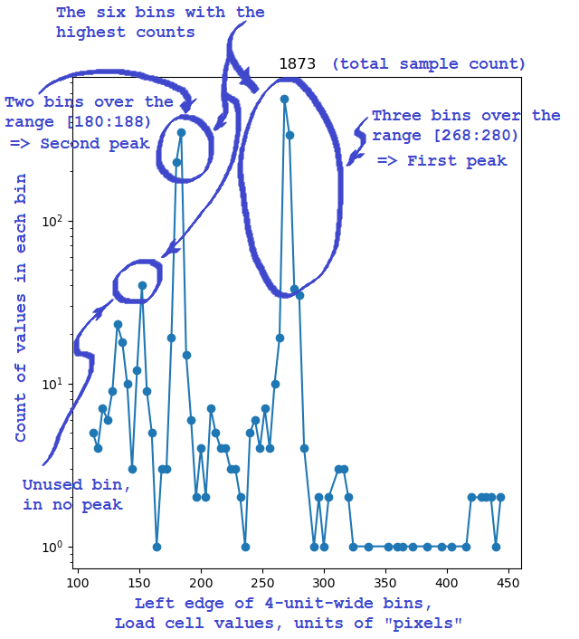

## Load cell data filters
Cf. https://www.plctalk.net/qanda/showthread.php?t=133372

### Approach I:  First-order data filter:

Usage:

    python plc_lowpass.py data_fixed.png [filterfactor]
    - default filter factor = 0.96

Input image, data_fixed.png, is modified version of image data.jpg
from Post #18 at the URL above.  This is simpler if you have the
actual data.

### Approach II:  Selection of data at or near two highest peaks in histograme of data

Brian T. Carcich, 2022-07-04

### Manifest

#### Allen-Bradley MicroLogix 1100 PLC program to implement filtered approach:

* data_fixed_plot.png - Plot of filtered results
* plc_lowpass.py - Script to generate data_fixed_plot.png
* training_two_setpoints_running_0.965.RSS - RSLogix Micro Starter Lite (500-ish) program
* training_two_setpoints_running_0.965.pdf - Printout of program and data

#### Allen-Bradley MicroLogix 1100 PLC program to implement histogram approach:

* data_histogram.png - Histogram plot of data from data_fixed.png
* train_histogram.py - Script to generate basis of data_histogram.png
* training_bubble_sort_running.RSS -  RSLogix MSL program
* training_bubble_sort_running.pdf - Printout of program and data

#### Supporting scripts
* emulate_load_cell.py - Script to emulate input data, writing to PLC using pycomm3; works with either PLC program above

#### Misc data

* plc_extract_red_data.py - Script to extract data from data_fixed.png; used by other scripts
* plc_lowpass.py - script to parse image pixels and plot data
* data.jpg - Original image of load cell data
* data_fixed.png - Modified version of data.jpg that eliminates false data detections
* data_fixed.xcf - GIMP format data_fixed.png
* .gitignore - Git meta-data
* README.md - this file
